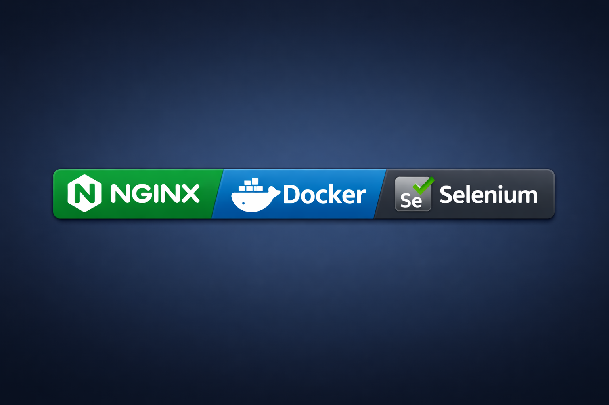

📘 README (English)
EventPulse
EventPulse is an application for tracking upcoming events:

Movies in Minsk
Concerts in Warsaw and Vilnius

Instead of constantly checking websites, users can leave a query for a future movie or concert. When such an event is found, the app will:
- Display it in the event list
- Send an email notification with a link to buy tickets
- Users can add or remove queries and events, manage them (stop searching, continue searching, etc.)

🔥 What’s New in EventPulse 2.0
A major upgrade of the entire backend stack:

- Docker Compose environment
- Nginx reverse proxy
- Adminer for database inspection
- New Selenium-based movie parser for Minsk
- More reliable than static HTML parsing
- Nginx gateway
- Static assets
- Reverse proxy to FastAPI
- Production-ready structure
- Improved architecture & project structure
- Clear separation of services
- Faster debugging
- Better maintainability

🔐 Authentication
- Registration and login with password (secure, password hashes only, not stored in plain text)
- Login via Google account (OAuth0)
- Supports Russian and English languages

⚙️ Tech Stack
- Python + FastAPI (asynchronous backend)
- BeautifulSoup (web scraping/parsing)
- PostgreSQL (database, can be replaced with another DB)
- HTMX JS (dynamic pages)
- OAuth0 (social login, configurable)
- SMTP Yandex (email notifications, configurable)
- Materialize CSS (UI/UX — clean and stylish design)

🔑 Features
- Middleware with JWT tokens for session management
- Private, public, and semi‑public routes
- Auto‑renewal of expiring sessions on user activity
- Language detection from browser if not explicitly chosen
- Passwords stored only as secure hashes
- Fully asynchronous — scraping does not block the app
- Configurable matching level between queries and events
- Safe password hashing and storage

📸 Screenshots

📬 Feedback
@Sharky1111

📖 License
EventPulse is distributed freely under the MIT License. You are free to use, modify, and share the application, provided that the original copyright notice and license are included.

📘 README (Русский)
EventPulse
EventPulse — приложение для отслеживания будущих событий:

- Кино в Минске
- Концерты в Варшаве и Вильнюсе

Вместо того чтобы постоянно проверять сайты, пользователь оставляет запрос на фильм или концерт. Когда событие найдено, приложение:
- Отобразит его в списке событий
- Отправит уведомление по электронной почте со ссылкой на покупку билета
- Можно добавлять и удалять запросы и события, управлять ими (больше не искать, искать дальше и т.д.)

🔥 Что нового в EventPulse 2.0
Крупное обновление всей серверной архитектуры:

- Docker Compose‑окружение
- Nginx reverse proxy
- Adminer для просмотра и анализа базы данных
- Новый Selenium‑парсер кино в Минске
- Более надёжный парсинг динамических страниц по сравнению со статическим HTML
- Nginx‑шлюз
- Раздача статических файлов
- Проксирование запросов к FastAPI
- Продакшен‑готовая структура проекта
- Улучшенная архитектура и структура кода
- Чёткое разделение сервисов
- Быстрая отладка
- Лучшая поддерживаемость

🔐 Авторизация
- Регистрация и вход по паролю (безопасно, хранится только хэш)
- Вход через Google аккаунт (OAuth0)
- Поддержка русского и английского языков

⚙️ Стек технологий
- Python + FastAPI (асинхронный бэкенд)
- BeautifulSoup (парсинг сайтов)
- PostgreSQL (БД, можно заменить)
- HTMX JS (динамические страницы)
- OAuth0 (социальная авторизация, можно менять)
- SMTP Yandex (почтовая рассылка, можно менять)
- Materialize CSS (UI/UX — лаконичный и стильный дизайн)

🔑 Особенности
- Миддлвар с JWT токенами для управления сессией
- Приватные, публичные и полупубличные маршруты
- Автопродление истекающей сессии при действиях пользователя
- Язык определяется через браузер, если не выбран пользователем
- Пароль хранится только как хэш
- Асинхронная работа — парсинг не мешает приложению
- Регулируемая степень совпадения названий запросов и событий
- Безопасное хранение паролей

📸 Скриншоты

📬 Обратная связь
@Sharky1111

📖 Лицензия
EventPulse распространяется свободно под лицензией MIT License. Вы можете использовать, изменять и распространять приложение при условии сохранения уведомления об авторских правах и текста лицензии.

## Скриншоты

## Обратная связь @Sharky1111